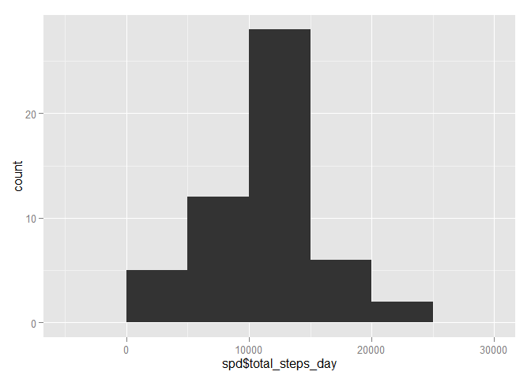
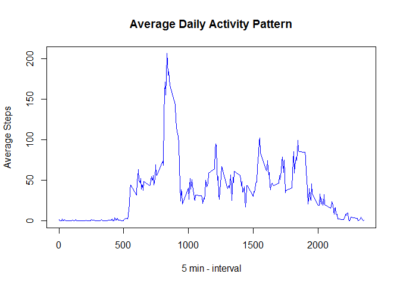
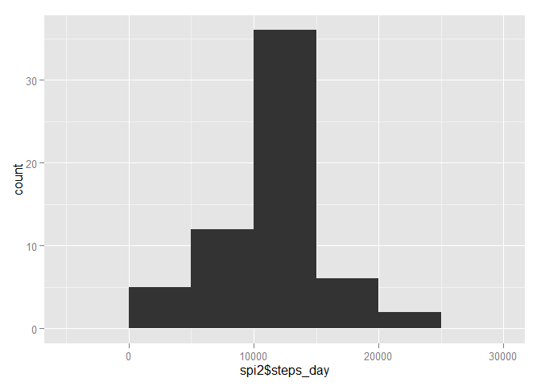
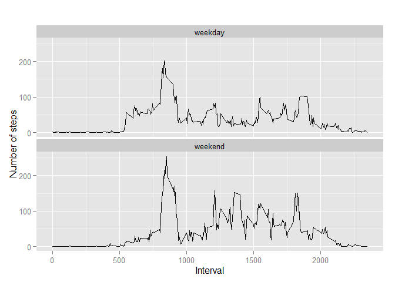

Loading and preprocessing the data
----------------------------------

Show any code that is needed to

1.  Load the data (i.e. read.csv())

2.  Process/transform the data (if necessary) into a format suitable for
    your analysis

<!-- -->

    library(readr)

    ## Warning: package 'readr' was built under R version 3.2.2

    library(dplyr)

    ## 
    ## Attaching package: 'dplyr'
    ## 
    ## The following object is masked from 'package:stats':
    ## 
    ##     filter
    ## 
    ## The following objects are masked from 'package:base':
    ## 
    ##     intersect, setdiff, setequal, union

    library(ggplot2)

    ## Warning: package 'ggplot2' was built under R version 3.2.2

    library(ggthemes)

    ## Warning: package 'ggthemes' was built under R version 3.2.2

    library(RColorBrewer)

    ## Warning: package 'RColorBrewer' was built under R version 3.2.2

    library(lubridate)

    ## Warning: package 'lubridate' was built under R version 3.2.1

    library(lattice)

    df <- read_csv("activity.csv", col_types="iDi")

    # filter out NAs
    df <- filter(df, steps=!is.na(steps))

What is mean total number of steps taken per day?
-------------------------------------------------

For this part of the assignment, you can ignore the missing values in
the dataset.

1.Calculate the total number of steps taken per day

    spd <- group_by(df, date) %>% summarise(total_steps_day=sum(steps))
     
    spd

    ## Source: local data frame [53 x 2]
    ## 
    ##          date total_steps_day
    ## 1  2012-10-02             126
    ## 2  2012-10-03           11352
    ## 3  2012-10-04           12116
    ## 4  2012-10-05           13294
    ## 5  2012-10-06           15420
    ## 6  2012-10-07           11015
    ## 7  2012-10-09           12811
    ## 8  2012-10-10            9900
    ## 9  2012-10-11           10304
    ## 10 2012-10-12           17382
    ## ..        ...             ...

2.If you do not understand the difference between a histogram and a
barplot, research the difference between them. Make a histogram of the
total number of steps taken each day

    ggplot(data=spd, aes(spd$total_steps_day)) + 
            geom_histogram(binwidth=5000)

3.Calculate and report the mean and median of the total number of steps
taken per day

    mean(spd$total_steps_day) 

    ## [1] 10766.19

    median(spd$total_steps_day)  

    ## [1] 10765

What is the average daily activity pattern?
-------------------------------------------

1.  Make a time series plot (i.e. type = "l") of the 5-minute interval
    (x-axis) and the average number of steps taken, averaged across all
    days (y-axis)

<!-- -->

    ## calculate average steps per interval 

    spi <-  group_by(df, interval) %>% summarise(mean_steps_interval=mean(steps))

    with(spi, plot(interval,mean_steps_interval,
                        type="l",
                        col="blue",
                        main="Average Daily Activity Pattern",
                        xlab="5 min - interval",
                        ylab="Average Steps")
                                    )

1.  Which 5-minute interval, on average across all the days in the
    dataset, contains the maximum number of steps?

<!-- -->

    max <- top_n(spi, 1, mean_steps_interval)
    max <- select(max, interval)
    print("Maximum Interval")

    ## [1] "Maximum Interval"

    max

    ## Source: local data frame [1 x 1]
    ## 
    ##   interval
    ## 1      835

Imputing missing values
-----------------------

Note that there are a number of days/intervals where there are missing
values (coded as NA). The presence of missing days may introduce bias
into some calculations or summaries of the data.

1.  Calculate and report the total number of missing values in the
    dataset (i.e. the total number of rows with NAs)

<!-- -->

    ## re-read dataframe to restore NAs
    df2 <- read_csv("activity.csv", col_types="iDi", na="NA") 

    NAs <- filter(df2, steps=is.na(steps))
    NAcount <- count(NAs, steps)

    NAcount

    ## Source: local data frame [1 x 2]
    ## 
    ##   steps    n
    ## 1    NA 2304

1.  Devise a strategy for filling in all of the missing values in the
    dataset. The strategy does not need to be sophisticated. For
    example, you could use the mean/median for that day, or the mean for
    that 5-minute interval, etc.

2.  Create a new dataset that is equal to the original dataset but with
    the missing data filled in.

<!-- -->

    ## use mean steps per interval to replace NAs

    ## change column name in lookup of mean steps per interval 
    lkup <- mutate(spi, steps=mean_steps_interval)
    lkup <- select(lkup, -mean_steps_interval)

    #join with lookup dataframe of mean steps per interval with dataframe with NAs only
    imputeddf <- inner_join(NAs, lkup, by="interval")

    imputeddf <- mutate(imputeddf, steps=steps.y) %>% 
            select(steps, date, interval, -steps.x, -steps.y)

    #combine with NA-free dataframe
    imputeddf <- rbind(imputeddf, df)

1.  Make a histogram of the total number of steps taken each day and
    Calculate and report the mean and median total number of steps taken
    per day. Do these values differ from the estimates from the first
    part of the assignment? What is the impact of imputing missing data
    on the estimates of the total daily number of steps?

<!-- -->

    ## calculate average steps per interval 

    spi2 <-  group_by(imputeddf, date) %>% 
            summarise(steps_day=sum(steps))

    ggplot(data=spi2, aes(spi2$steps_day)) + 
            geom_histogram(binwidth=5000)

    spd <- group_by(imputeddf, date) %>% summarise(total_steps_day=sum(steps))
     
    mean(spd$total_steps_day)

    ## [1] 10766.19

    median(spd$total_steps_day)

    ## [1] 10766.19

not a big difference betweenthe data sets with or without imputed values

Are there differences in activity patterns between weekdays and weekends?
-------------------------------------------------------------------------

For this part the weekdays() function may be of some help here. Use the
dataset with the filled-in missing values for this part.

1.  Create a new factor variable in the dataset with two levels -
    "weekday" and "weekend" indicating whether a given date is a weekday
    or weekend day.

<!-- -->

    #add column for day of week
    weekType <- mutate(imputeddf, weekday = wday(date))

    #
    weekType <- mutate(weekType, day_type = as.factor(ifelse(weekday==6|weekday==7, "weekend", "weekday")))

1.  Make a panel plot containing a time series plot (i.e. type = "l") of
    the 5-minute interval (x-axis) and the average number of steps
    taken, averaged across all weekday days or weekend days (y-axis).
    See the README file in the GitHub repository to see an example of
    what this plot should look like using simulated data.

<!-- -->

    # calculate average steps by interval across all days
    finaldf <- group_by(weekType, interval, day_type) %>% 
            summarise(steps=mean(steps))                                              

    # creat a plot
    qplot(interval, 
          steps, 
          data = finaldf, 
          type = 'l', 
          geom=c("line"),
          xlab = "Interval", 
          ylab = "Number of steps", 
          main = "") +
      facet_wrap(~ day_type, ncol = 1)

